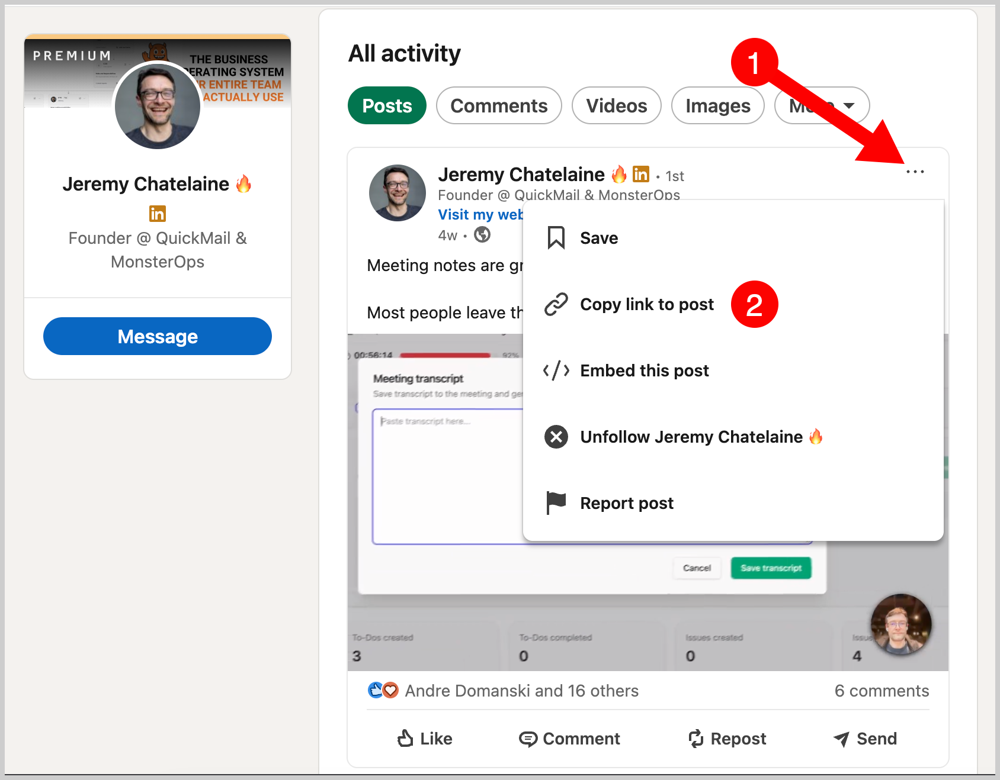
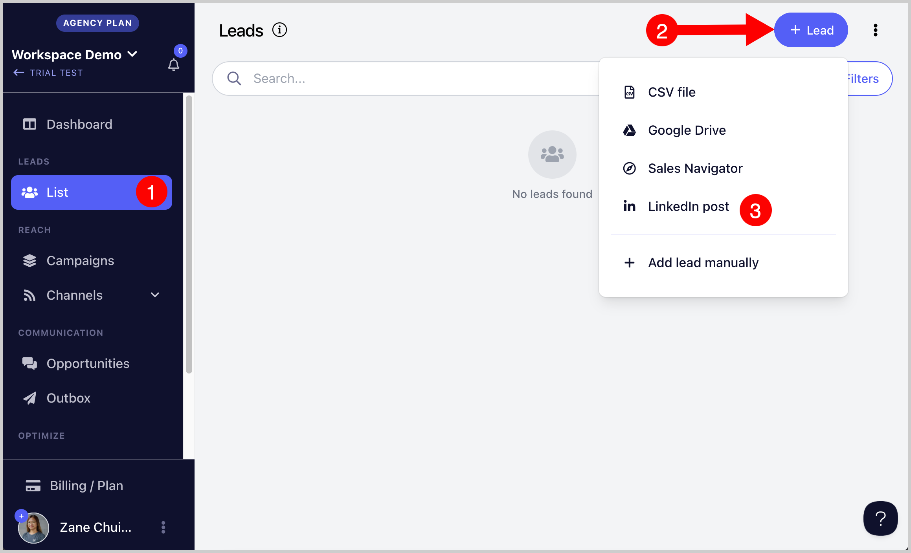
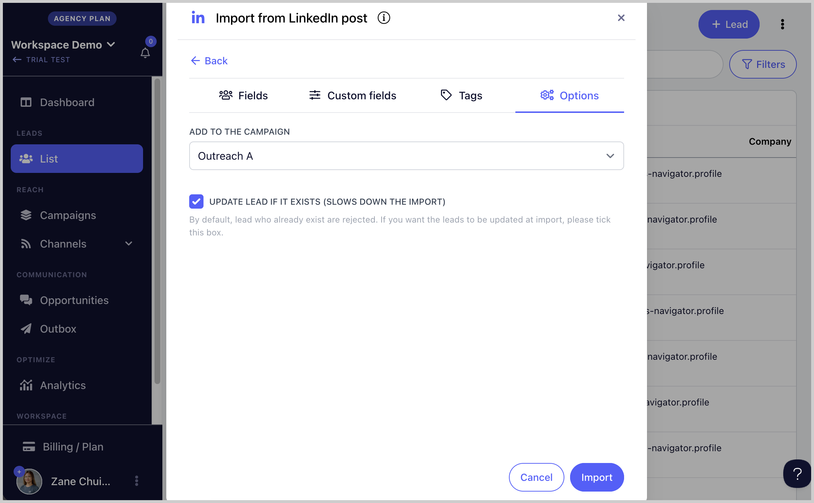
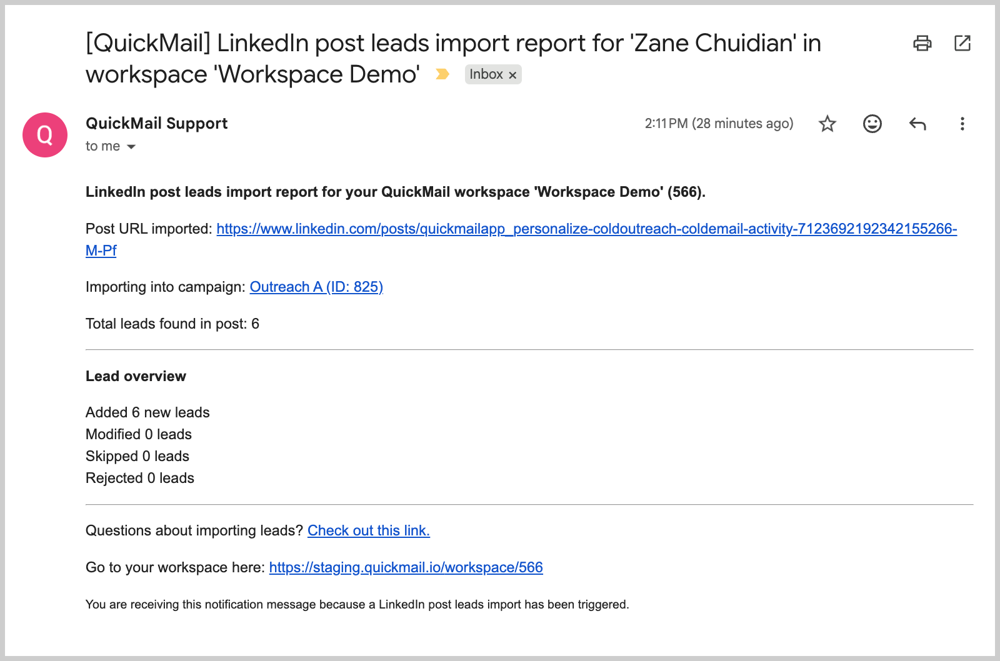

# Importing from a LinkedIn Post 📲

You can import leads who engaged with a LinkedIn post directly into QuickMail.

**Tip:** You can also import leads from another person's LinkedIn post.

**In this article:**

- How to import leads from a LinkedIn post?

## How to Import Leads from a LinkedIn Post?

**Step 1.** Add a LinkedIn account to QuickMail. Go to **LinkedIn** → **+ LinkedIn**. This guide on adding LinkedIn accounts might come in handy.
https://help.quickmail.com/linkedin/adding-linkedin-accounts/

**Step 2.** On a separate browser tab, go to the LinkedIn post you would like to import leads from and copy the post link.

**Step 3.** Go to **List** → **+ Lead** → **LinkedIn Post**.

**Step 4.** Paste the LinkedIn post link into QuickMail.

**Step 5.** Map the lead properties and add custom properties or tags if needed.

**Step 6.** Select the campaign where you would like to add the leads (optional) → click **Import**.

**Step 7.** An import report will be sent via email showing how many leads were imported or rejected.

