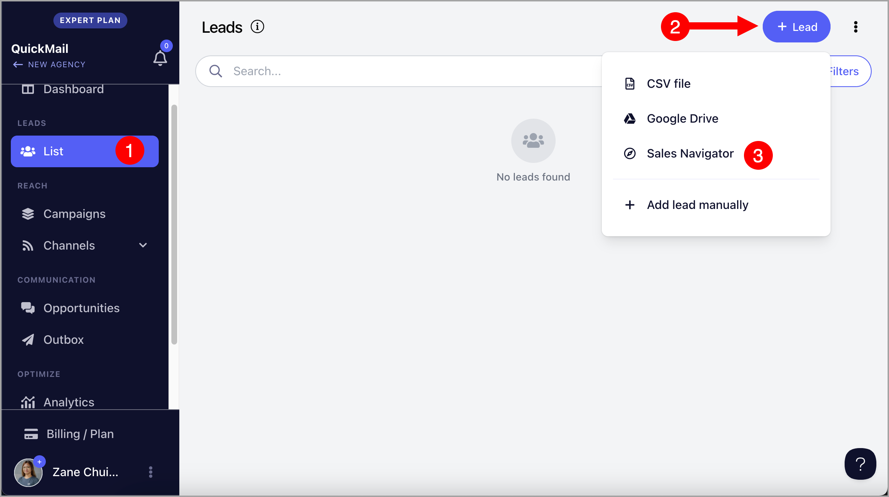

# Importing from LinkedIn Sales Navigator 🧭

Our integration with LinkedIn Sales Navigator allows you to easily import selected leads into QuickMail. This is especially useful for running LinkedIn outreach.

**Note:** While LinkedIn profile URLs and other lead details are imported, email addresses are not included.

# How to import from Sales Navigator?

## Option 1: Manual Import

**Step 1.** Add a LinkedIn account that has Sales Navigator subscription. Go to Channels → LinkedIn → + LinkedIn. This guide about Adding LinkedIn accounts might come in handy.

**Note:** LinkedIn accounts showing a brown icon are supported for Sales Navigator. If the icon is blue, the account isn’t compatible.

**Step 2.** Go to [Sales Navigator](https://www.linkedin.com/sales/home) > Search for the leads you'd like to import → Use filters to narrow down your search if needed → Copy the URL

**Note:** Recent Search links are not yet support. The URL Should start with [https://www.linkedin.com/sales/search/people?query=](https://www.linkedin.com/sales/search/people?query=) from fresh search.

**Step 3.** Go to Leads → + Add Leads → Import from Sales Navigator

**Step 4.** Paste the URL copied from Sales Navigator → Follow the on screen instructions to setup import

## What happens when I lose permission to my LinkedIn account?

When we lose permission to access your LinkedIn account, it will be highlighted in red, and it will no longer be possible to import from Sales Navigator.

Click re-authenticate to continue using the LinkedIn account.

## Option 2: Auto-import

Auto-Import continuously monitors your saved Sales Navigator search. When a new lead appears, it’s automatically pulled into your list or campaign so you can engage without lifting a finger.

**Step 1.** To setup auto-import with Sales Navigator, first, addd a LinkedIn account that has Sales Navigator subscription. Go to Channels → LinkedIn → + LinkedIn. This guide about Adding LinkedIn accounts might come in handy.

**Note:** LinkedIn accounts showing a brown icon are supported for Sales Navigator. If the icon is blue, the account isn’t compatible.

**Step 2.** Go to [Sales Navigator](https://www.linkedin.com/sales/home) > Search for the leads you'd like to import → Use filters to narrow down your search if needed → Copy the URL

**Note:** Recent Search links are not yet support. The URL Should start with [https://www.linkedin.com/sales/search/people?query=](https://www.linkedin.com/sales/search/people?query=) from fresh search.

**Step 3.** Go to Leads → + Add Leads → Import from Sales Navigator

 Paste the URL copied from Sales Navigator → Follow the on screen instructions to setup import

**Step 5.** Setup the auto-import and under Options, check the box 'Re-run this import at regular intervals' → Then select preferred interval

**Tip:** You can select a campaign in the **“Add to campaign”** dropdown to automatically add new leads from Auto-Import to that campaign.

When a new lead appears, it’s automatically added to your list or campaign, so you can engage them right away without having to search again.

**FAQs**
Q: I tried importing via Sales Navigator and it keeps showing 0 leads found.
Most of the time it's because of this error "2FA Login challenge not found"

This error means LinkedIn is adding an extra security step, like emailing you a login code or triggering a captcha whenever you attempt to log in.

You can try to log out and log back in to your LinkedIn account using your browser to see if it will trigger the security step.
If that doesn't do the trick, you can log in to an incognito window to see the log in challenge and complete it.

If neither works, you’ll need to wait until LinkedIn stops sending those codes before you can connect it to QuickMail.
Unfortunately, we can’t bypass it since the code is sent somewhere we have no access to (like email or captcha).

Here's a more detailed guide on it:
https://www.linkedin.com/help/linkedin/answer/a1339220/security-verification-when-signing-in?lang=en
