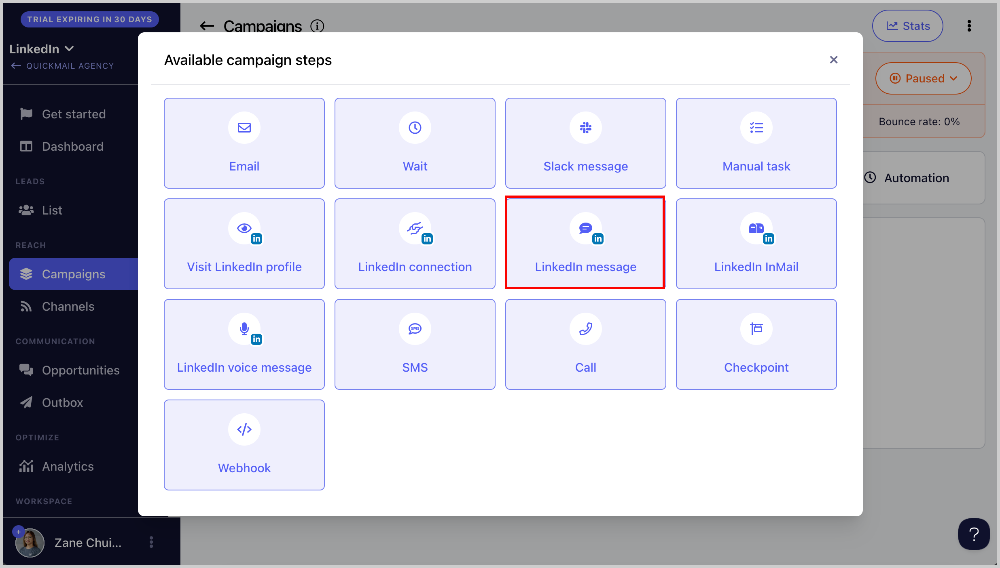
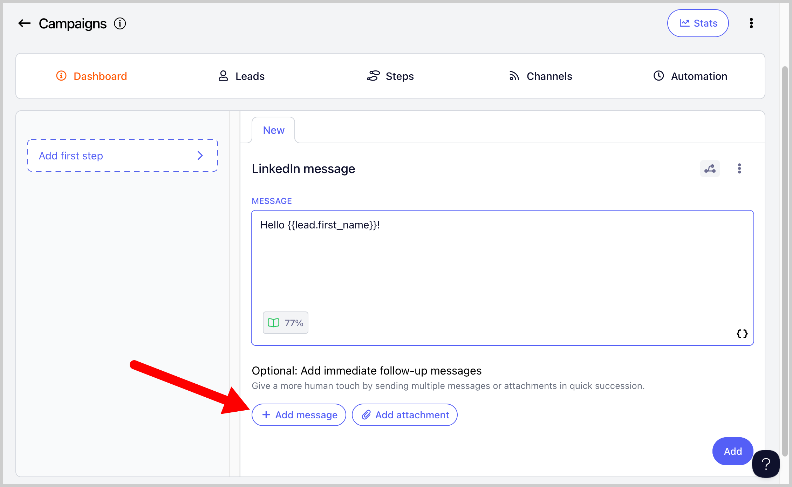
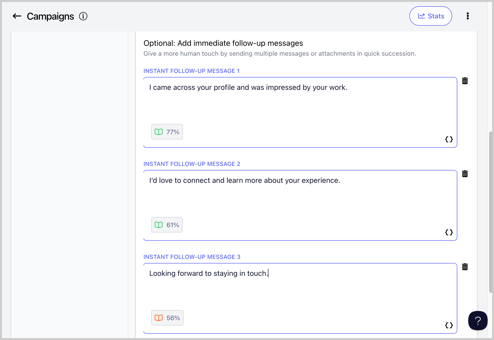

# Instant LinkedIn Follow Ups (Double Tap) ⚡

Instant follow-ups help you deliver your message in a way that feels faster, more natural, and easier to engage with.

Instead of overwhelming someone with a long initial message, you break it into short, digestible parts that arrive immediately, making it feel more like a real conversation than automation and helps improve readability.

**Step 1.** To send instant follow up messages, go to a campaign and add a LinkedIn Message Step.

**Step 2.** Create an initial LinkedIn message, and then click '+Add Message' below the LinkedIn message.

**Step 3.** Add more follow up messages as needed.

