# LinkedIn Automation 🤖

💡 The number of LinkedIn accounts you can add depends on your [plan](https://quickmail.com/pricing).

**In this article:**

**What can I do with QuickMail's LinkedIn Automation?**

- Generate profile views

- Send LinkedIn connection requests

- Send LinkedIn messages

- Send instant follow-up LinkedIn messages

- Send LinkedIn voice messages

- Send LinkedIn InMails

- Import leads with Sales Navigator

- Import leads who viewed your profile

- Import leads from a LinkedIn post

**How to set up LinkedIn Automation?**

- Add a LinkedIn account

  - Via browser extension

  - Via cookies

  - Via LinkedIn credentials + 2FA

- Add the lead's LinkedIn profile URL

- Assign a LinkedIn account to a campaign

- Add a LinkedIn step to a campaign

**LinkedIn Settings**

- How can I change the daily limit for my LinkedIn actions?

- How can I see the acceptance rate of my LinkedIn campaign?

- How can I check the account for new connections?

- How to re-authenticate a LinkedIn account?

  - Via cookies

  - Via LinkedIn credentials + 2FA

- How do I know if a LinkedIn connection request has already been sent to a lead?

- How to delete a LinkedIn account?

- How can I prevent accepted connection requests from creating Opportunities?

- FAQs

## What Can I Do with QuickMail's LinkedIn Automation?

QuickMail offers 9 LinkedIn automation features:

### Generate Profile Views

Helps create familiarity and boost connection and reply rates by making your approach feel more natural.

### Send LinkedIn Connection Requests

Allows you to send connection requests to leads without having to do it manually.

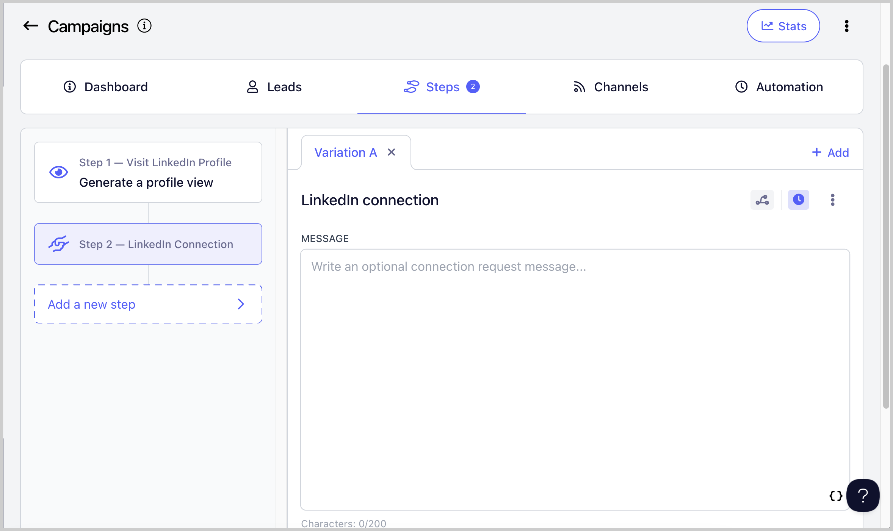

**Important notes:**

- LinkedIn connection requests are automatically withdrawn after 90 days. When this happens, the lead's status will change from "Running" to "Canceled."

- Connection requests can be resent after 3 weeks.

- LinkedIn does not allow sending messages to leads you are not yet connected with.

- Because of this, the **Wait Until Connection Request is Accepted** setting is enabled by default on connection request steps. This means a lead will not proceed to the next step until the connection request is accepted. You can disable this setting here:

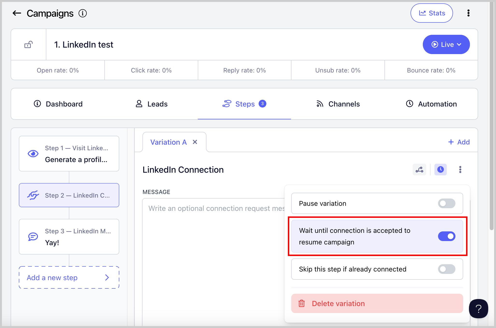

### Send LinkedIn Messages

Allows you to send LinkedIn messages to leads you are already connected with.

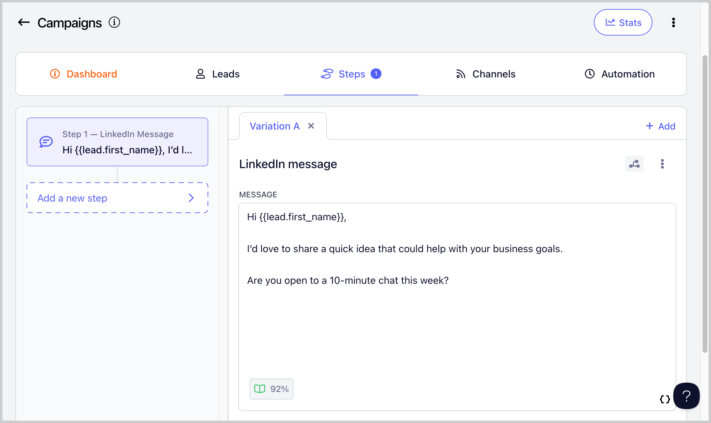

### Send Instant Follow-Up LinkedIn Messages

Allows you to send multiple messages or attachments in quick succession, making your outreach feel more natural, like a real conversation.

### Send Attachments

Allows you to add attachments to your LinkedIn messages. This can make your outreach more engaging and gives leads something tangible to review, such as a case study, one-pager, or portfolio.

### Send LinkedIn InMails

Allows you to send LinkedIn InMail messages without needing to be connected to the lead.

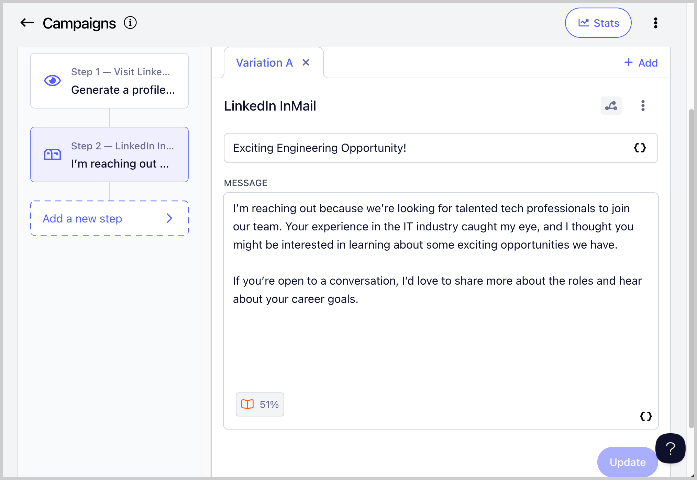

### Send LinkedIn Voice Messages

Allows you to send voice messages to leads. Voice messages can help you stand out, grab attention faster, and build trust more effectively than text messages.

### Import Leads Who Viewed Your Profile

**Note:** LinkedIn imports do not include email addresses. If you want to run email campaigns on imported leads, you will need to manually find and update their email addresses in QuickMail. Otherwise, leads will run into an error and get stuck in the campaign.

You can automatically import leads who viewed your profile into QuickMail.

To enable this, go to **LinkedIn** → click on the LinkedIn account → **Receiving** tab → check **Create leads from profile viewers** → optionally select a campaign to add the leads to.

### Import Leads from a LinkedIn Post

Allows you to import leads who engaged with a LinkedIn post directly into QuickMail.

**Tip:** You can also import leads from another person's LinkedIn post.

To use this feature, go to **List** → **Import from LinkedIn Post** → paste the LinkedIn post link → continue with the on-screen prompts.

## How to Add a LinkedIn Account for Outreach?

There are three ways to add a LinkedIn account:

- **Via browser extension** — the easiest way to add a LinkedIn account.

- **Via cookies** — prone to account disconnection.

- **Via LinkedIn credentials + 2FA** — more stable, but setup may be trickier if two-step verification has not been configured yet.

**Important:** If you do not have access to the LinkedIn account directly, you can generate an invite link instead.

### Option 1: Via Browser Extension

**Step 1.** Log in to the LinkedIn account you want to add.

**Step 2.** In a separate browser tab, open QuickMail and go to **LinkedIn** → click **Browser Extension**.

**Step 3.** Click **Install the Chrome Extension**.

**Step 4.** Once the extension is installed, a new tab will open. The LinkedIn account currently signed in will be detected automatically. Select the account and the workspace where you would like to add it.

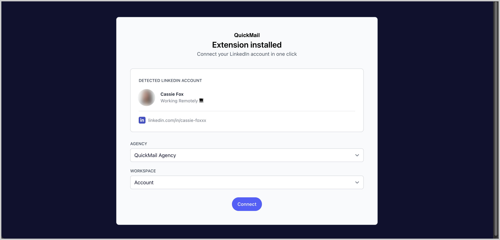

**Step 5.** You will receive a confirmation indicating whether the LinkedIn account was added successfully. From the same page, you can also view the LinkedIn account activity.

### Option 2: Via Cookies

**Step 1.** Install the cookies extension on your browser using this [link](https://chrome.google.com/webstore/detail/copy-cookies/jcbpglbplpblnagieibnemmkiamekcdg).

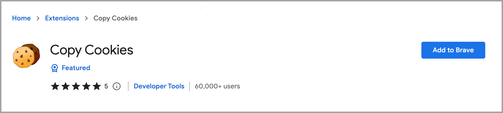

**Step 2.** Once installed, go to your LinkedIn profile and click the cookie icon to copy the page cookies.

If you do not see the cookie icon, click the puzzle icon in your browser toolbar to view all installed extensions.

**Step 3.** Go to **LinkedIn** → **+ LinkedIn** → **LinkedIn Cookies**.

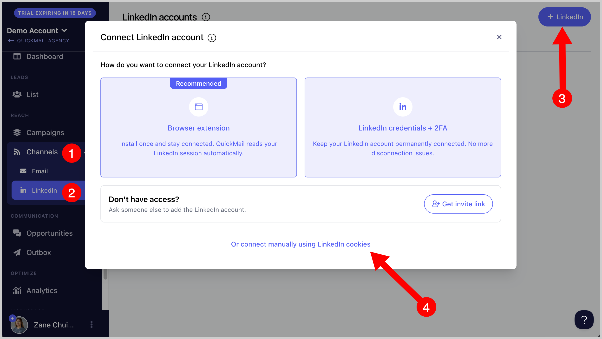

**Step 4.** Select your country → paste the cookies → click **Add**. The LinkedIn account will be added immediately.

**Important:** Logging out of your LinkedIn account will disconnect it from QuickMail by invalidating the cookies. To avoid this, log in through an incognito window and close the window when done without logging out.

### Option 3: Via LinkedIn Credentials + 2FA

**Step 1.** Log in to your LinkedIn account in a separate browser tab → click **Me** → **Settings & Privacy**.

**Step 2.** Go to **Sign in & Security** → click **Two-Step Verification**.

- If two-step verification is already enabled, temporarily disable it, then proceed to the next step.

- If two-step verification is not enabled, proceed to the next step to enable it.

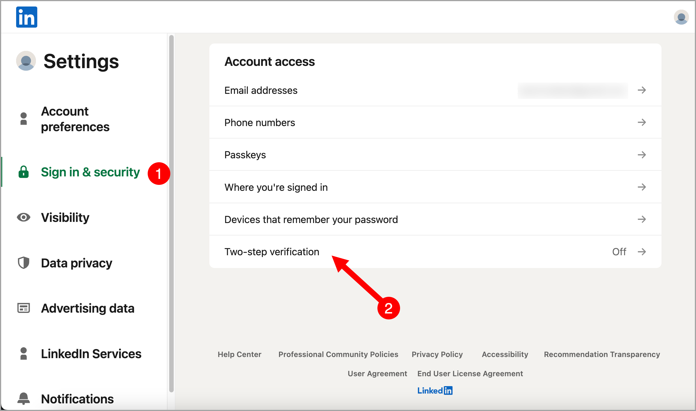

**Step 3.** Enable two-step verification → enter the code sent to your email address → click **Submit**.

**Step 4.** Select **Authenticator App** → click **Continue** → enter your LinkedIn password to proceed.

**Step 5.** Download an authenticator app on your mobile phone, such as [Google Authenticator](https://support.google.com/accounts/answer/1066447?hl=en&co=GENIE.Platform%3DAndroid) or [Microsoft Authenticator](https://www.microsoft.com/en-us/security/mobile-authenticator-app).

**Step 6.** In your authenticator app, open the QR scanner and scan the QR code displayed on your screen. This will add your LinkedIn account to the authenticator app.

**Step 7.** Once the authenticator is set up, copy the code shown below the QR code and save it somewhere safe (such as a Notepad file) → click **Continue**.

**Step 8.** Enter the code shown in your authenticator app → click **Verify**. Two-factor authentication is now set up on your LinkedIn account.

**Step 9.** Log out of your LinkedIn account, then log back in.

**Step 10.** Copy the 2FA code you saved earlier.

**Step 11.** Go to **LinkedIn** → **+ LinkedIn** → **LinkedIn Credentials + 2FA**.

**Step 12.** Select your country → enter the email address and password associated with your LinkedIn account → paste the 2FA code → click **Add**.

It may take a few minutes for the LinkedIn account to be added, but no longer than an hour.

**Note:** If you have trouble adding your LinkedIn account, contact support at support@quickmail.io and tell them the error you're getting.

## How to Add a Lead's LinkedIn Information?

A lead's LinkedIn information can be added manually or in bulk via import.

**Note:** Leads scraped from third-party tools with unique URL IDs assigned to LinkedIn profiles are not supported, as these differ from actual LinkedIn Profile URL IDs. Scraping also violates LinkedIn's policy.

Here is the correct format and where to find a lead's LinkedIn Profile URL ID:

### Manually Adding a Lead's LinkedIn ID

Go to **List** → click on a lead → from the quick view, click **+ Show Properties** → add the LinkedIn profile URL.

### Bulk Adding Leads' LinkedIn IDs

Add a LinkedIn column to your CSV or Google Sheet. When importing leads, map the LinkedIn column to the LinkedIn property in QuickMail.

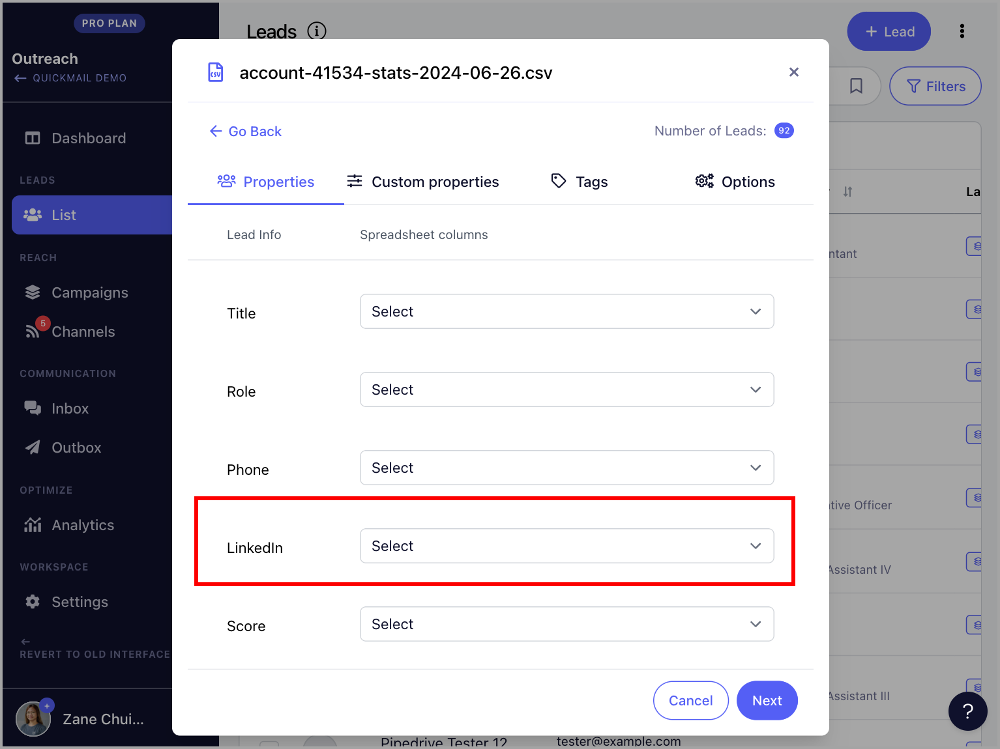

💡 **Pro tip:** If your leads are already in the account, make sure to check **Update lead if it exists** when re-importing. Without this, updates will be rejected to prevent duplicates.

## How to Assign a LinkedIn Account to a Campaign?

Go to the campaign → **Channels** → **LinkedIn** tab → toggle the LinkedIn account on.

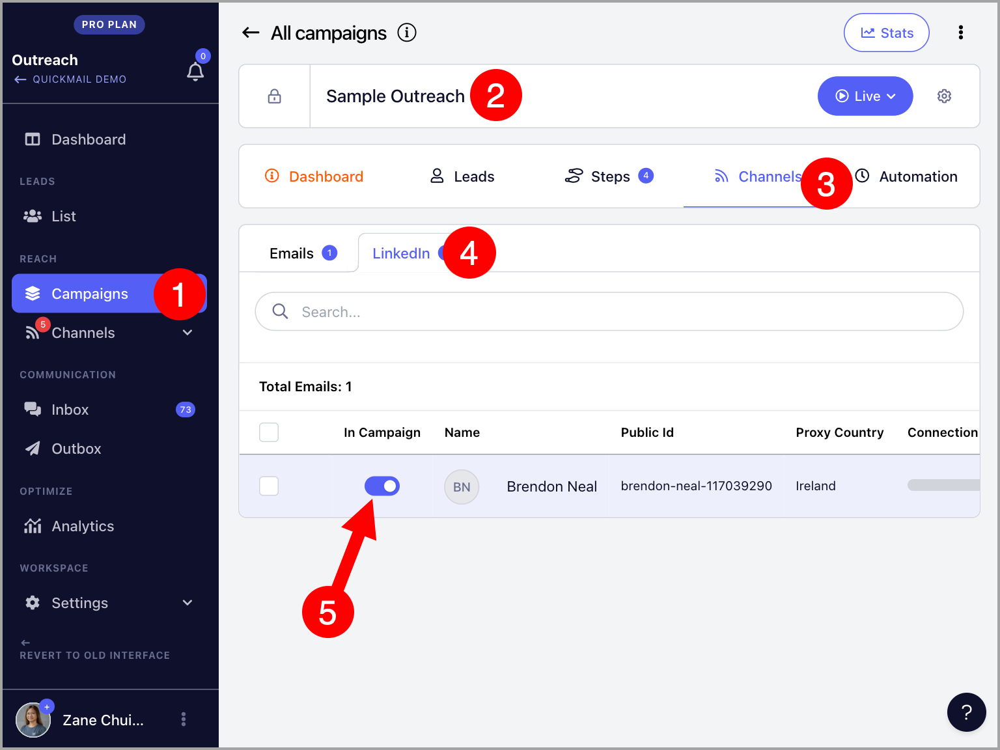

💡 **Pro tip:** You can assign as many LinkedIn accounts as needed to a campaign. You can check a LinkedIn account's quick view in the Channels page to easily see which campaigns it is assigned to.

## How to Create a LinkedIn Step?

Go to the campaign → **Steps** → click **Add Step** → select **LinkedIn Connection Step** or **LinkedIn Message Step**.

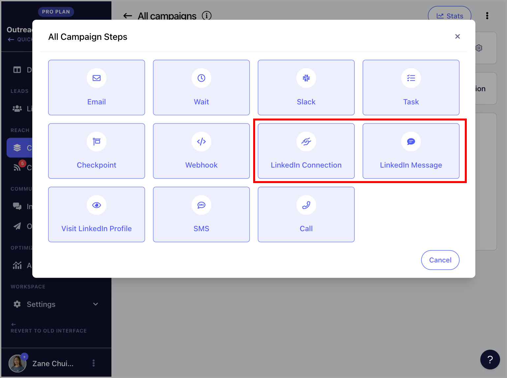

💡 **Pro tip:** To learn more about managing LinkedIn outreach in QuickMail, check out these guides:

- Automate Sending LinkedIn Connection Requests

- Automate Sending LinkedIn Messages

## How Can I Change the Daily Limits of My LinkedIn Actions?

Go to **LinkedIn** → select a LinkedIn account → **Sending** tab → **LinkedIn Actions Limit and Throttling**.

QuickMail recommends not exceeding 12 actions per day to avoid LinkedIn restrictions. There is no maximum cap in the system, and each LinkedIn account may have different limits. For more details, see [LinkedIn's guide on invitation restrictions](https://www.linkedin.com/help/linkedin/answer/a551012/types-of-restrictions-for-sending-invitations).

## How Can I See the Acceptance Rate of My LinkedIn Campaign?

The acceptance rate of LinkedIn connection requests can be found in the campaign stats.

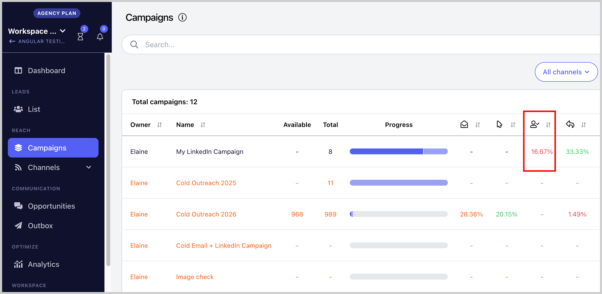

## How Do I Know if a LinkedIn Connection Request Has Already Been Sent to a Lead?

Leads who have already been sent a connection request will have an orange LinkedIn icon in their thumbnail. A blue icon means no connection request has been sent yet.

## How Can I Check the Account for New Connections?

QuickMail automatically scans for new connections roughly every hour after a LinkedIn account is linked.

If you prefer not to wait, you can manually trigger a sync. Note that manual syncing can only be done 12 hours after the last check.

To do this, go to **LinkedIn** → select a LinkedIn account → **Receiving** tab → scroll down → click **Sync Now**.

You can also check whether a lead is already connected with you on LinkedIn by using the Lead filter and selecting the **LinkedIn Network Distance** filter to view:

- 1st-degree connections

- 2nd-degree connections

- 3rd-degree++ connections

## How to Re-authenticate a LinkedIn Account?

### For LinkedIn Accounts Added Via 2FA

Contact support at [support@quickmail.io](mailto:support@quickmail.io).

### For LinkedIn Accounts Added Via Cookies

Logging out of LinkedIn invalidates the cookies, which disconnects the account from QuickMail.

If the account loses permission, a warning will appear on the LinkedIn page in Settings and an email notification will be sent to the account owner.

To re-authenticate, log back in to LinkedIn, then update the cookies in the LinkedIn account settings. 
See the steps for adding a LinkedIn account via cookies for guidance.

## How to Delete a LinkedIn Account?

Go to **LinkedIn** → select the LinkedIn account → click the menu icon (three vertical dots) → **Delete**.

## How Can I Prevent Accepted Connection Requests from Creating Inbox Items?

By default, an item is created in the Inbox when a lead accepts a connection request. To disable this, go to **Replies Settings** → disable **New connections create new opportunities**.

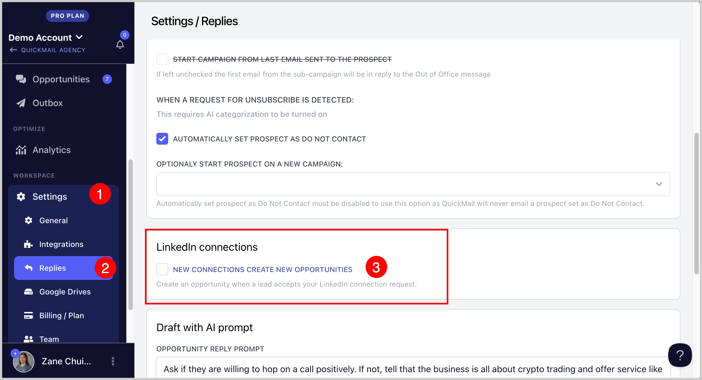

## FAQs

### Can I send a LinkedIn message to people I'm not connected with?

No. LinkedIn does not allow sending messages to people you are not connected with unless your LinkedIn account has InMail credits, which require a premium LinkedIn subscription.

### What will happen if I try sending a LinkedIn message to someone I'm not connected with?

The lead's status in the campaign will encounter an error and the sequence will stop.

### Can I send emails and LinkedIn messages in the same campaign?

Yes. However, if a lead has not accepted your LinkedIn connection request, it may cause delays since campaigns run linearly. In that case, it may be better to create separate campaigns for LinkedIn and email outreach.

### My LinkedIn account keeps disconnecting. Why?

QuickMail uses cookies to connect to your LinkedIn account. When you log out of LinkedIn in your browser, the session cookie expires and QuickMail loses access to the account.

### My LinkedIn account got disconnected. How can I reconnect?

Please follow this guide.

### I keep getting an error importing leads because of their LinkedIn profile. How do I fix it?

If the leads were scraped from a third-party tool, the tool may have assigned unique URL IDs that differ from the actual LinkedIn Profile URL IDs, which are not supported. Here is the correct format and where to find the LinkedIn Profile URL ID:

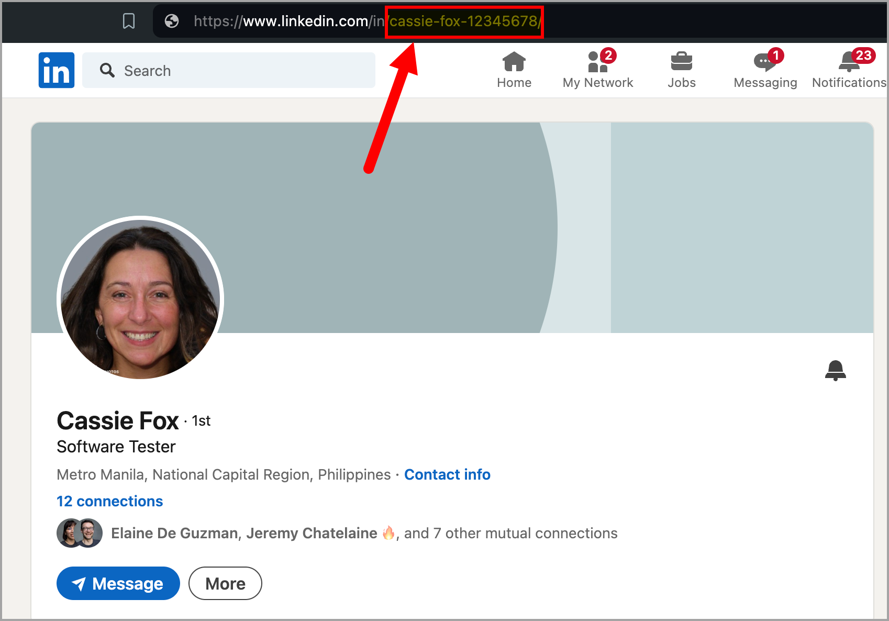
