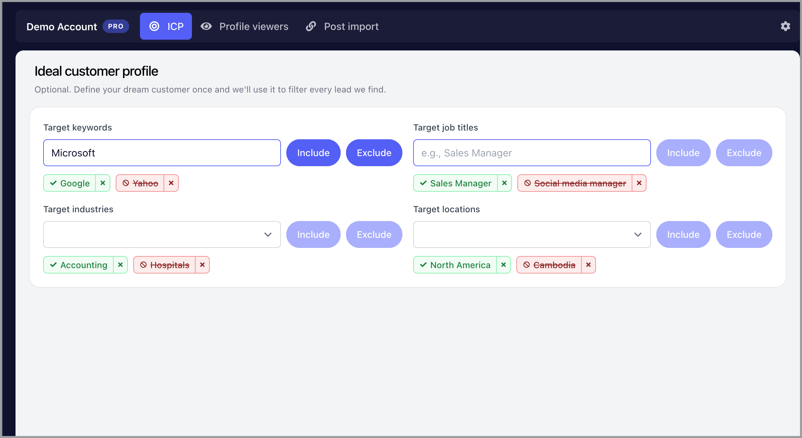
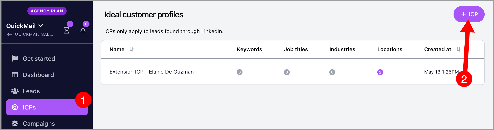
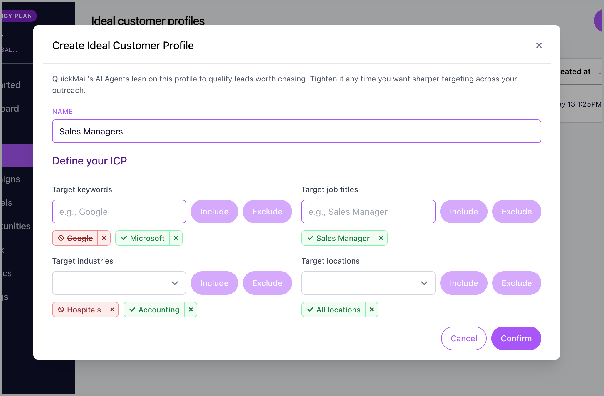

# Managing LinkedIn Import with ICP Filters

**In this article:**

- What are ICP filters?

- Why use ICP filters?

- Where do I set up ICP filters?

- How to create an ICP filter?

- What filters can I use?

- How do I know if my filters are working?

- FAQs

## What Are ICP Filters?

ICP (Ideal Customer Profile) filters let you control which LinkedIn profiles get imported into your campaigns. You can target specific job titles, industries, and locations, and exclude companies you do not want to contact.

ICP filters are applied to LinkedIn post and profile viewer imports.

## Why Use ICP Filters?

ICP filters help you import only the leads that match your target audience, saving time and keeping your campaigns focused.

Without ICP filters, you would need to manually review and remove profiles that do not fit your criteria after import. With ICP filters, you can:

- **Import only qualified leads** — skip profiles that do not match your target job titles, industries, or locations.

- **Avoid contacting the wrong companies** — exclude competitors, existing clients, or companies you do not want to reach.

- **Keep your campaigns clean** — reduce manual cleanup and maintain better list quality from the start.

## Where Do I Set Up ICP Filters?

ICP filters can be set up in two places:

- **Importing from LinkedIn post**
  

- **Importing Profile Viewers via LinkedIn Settings**
  

- **Importing Profile Viewers via LinkedIn Browser Extension**
  

## What Filters Can I Use?

You can use the following filters to define your ICP:

- **Target keywords** — include or exclude profiles based on specific keywords such as company names or skills.

- **Target job titles** — import only profiles with specific job titles, such as "Marketing Manager" or "CEO."

- **Target industries** — import only profiles from specific industries, such as "Software" or "Healthcare."

- **Target locations** — import only profiles from specific locations, such as "United States" or "London."

You can add multiple values for each filter type. If you add multiple values within the same filter (for example, multiple industries), profiles only need to match at least one of those values.

## How to Create an ICP Filter?

**From the LinkedIn extension:**

- Click the QuickMail extension icon in your browser toolbar.

- Click the **ICP** tab.

- In **Target keywords**, type a keyword and click **Include** to target it or **Exclude** to skip it.

- In **Target job titles**, type a job title and click **Include** to target it or **Exclude** to skip it.

- In **Target industries**, select an industry from the dropdown and click **Include** to target it or **Exclude** to skip it.

- In **Target locations**, select a location from the dropdown and click **Include** to target it or **Exclude** to skip it.

ICP filters will automatically be applied to your LinkedIn profile viewer and post imports.

**From the QuickMail app:**

- Go to the **ICP** section in your QuickMail account.

- Click the button to create a new ICP.

- Name your ICP.

- In **Target keywords**, type a keyword and click **Include** to target it or **Exclude** to skip it.

- In **Target job titles**, type a job title and click **Include** to target it or **Exclude** to skip it.

- In **Target industries**, select an industry from the dropdown and click **Include** to target it or **Exclude** to skip it.

- In **Target locations**, select a location from the dropdown and click **Include** to target it or **Exclude** to skip it.

- Click **Confirm**.

## How Do I Know if My Filters Are Working?

After a LinkedIn import completes, you will receive an email with an import report showing:

- How many profiles were imported.

- How many profiles were skipped.

- Why profiles were skipped (for example, excluded company, wrong industry, or location did not match).

Check this report to confirm your ICP filters are working as expected.

## FAQs

**Can I use multiple industries or locations in one ICP?**

Yes. You can add multiple keywords, job titles, industries, and locations to a single ICP. Profiles only need to match at least one value within each filter type.

**Do ICP filters apply to imports I already created?**

No. ICP filters only apply to new imports created after they are set up. For post imports created before ICP filters were configured, leads will not be filtered. For profile viewers, ICP filters will apply to new profile viewers going forward, but leads already imported will not be affected.

**What happens if a profile does not match my ICP filters?**

The profile will be skipped during import. You can see which profiles were skipped and why in your import report email.

**Can I edit my ICP filters after creating them?**

Yes. You can edit your ICP filters at any time from the ICP section in the QuickMail app or through the LinkedIn extension. Changes will apply to future imports.

**What is the difference between "Include" and "Exclude"?**

- **Include** — only import profiles that match this criterion.

- **Exclude** — skip profiles that match this criterion, even if they match your other filters.

For example, if you exclude "Google" as a keyword, profiles from Google will be skipped even if they match your target job titles and industries.

**Do excluded filters override included filters?**

Yes. If a profile matches any excluded filter, it will be skipped even if it matches all included filters.

**How are industries matched?**

Industries on LinkedIn are self-reported, so matching is based on the industry listed on the lead's LinkedIn profile.
