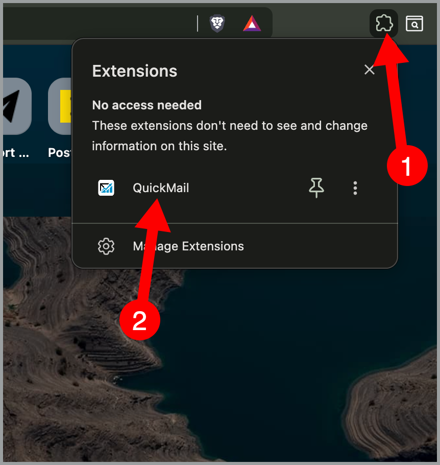
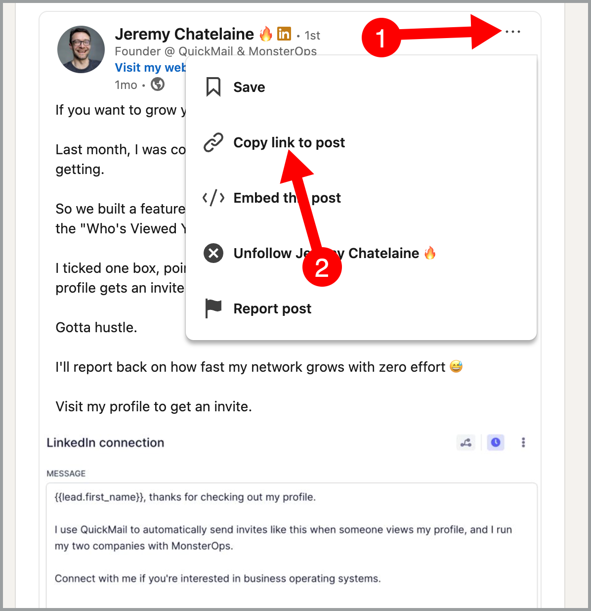

# QuickMail's LinkedIn Browser Extension

**In this article:**

- [Why Use QuickMail's LinkedIn Browser Extension?](#why-use-quickmails-linkedin-browser-extension)
- [What Can You Do with QuickMail's LinkedIn Browser Extension?](#what-can-you-do-with-quickmails-linkedin-browser-extension)
- [How to connect your LinkedIn account?](#how-to-connect-your-linkedin-account)
- [How to setup your ICP filters](#how-to-setup-your-icp-filters)
- [How to create a Profile Viewers campaign](#how-to-create-a-profile-viewers-campaign)
- [How to Create a Post Import Campaign](#how-to-create-a-post-import-campaign)
- [FAQs](#faqs)

## Why Use QuickMail's LinkedIn Browser Extension?

QuickMail's LinkedIn extension allows you to seamlessly connect your LinkedIn account and setup LinkedIn campaigns directly from your browser making your outreach setup faster and more efficient.

## What Can You Do with QuickMail's LinkedIn Browser Extension?

With the QuickMail LinkedIn Browser Extension, you can automatically import and engage with high-intent LinkedIn prospects.

**1. Automatically Reach Out to People Who View Your LinkedIn Profile**

Automatically import people who view your LinkedIn profile into a **Profile Viewers Campaign** in your QuickMail account, so you can follow up without any manual work.

**2. Import People Who Engage with Your LinkedIn Posts**

Import people who **like** or **comment** on your LinkedIn posts directly into QuickMail, making it easy to follow up with engaged prospects.

**3. Filter Imported Profiles with ICP Filters**

Control which profiles are imported by setting **Ideal Customer Profile (ICP)** filters.

Available filters include:

* Job titles
* Industries
* Locations
* Open to Work status
* Excluded companies

ICP filters apply to both **Profile Viewers** and **Post Import** campaigns, ensuring that only the prospects matching your criteria are imported.

**4. See your LinkedIn account activities**

The QuickMail LinkedIn Browser Extension shows your LinkedIn activity for the current day, including:
* Profile views
* Connection requests sent
* InMails sent
* LinkedIn messages sent

This helps you monitor your daily LinkedIn activity and stay within your outreach limits.

## How to connect your LinkedIn account?

**Step 1.** Before you start, make sure you're logged in to both your LinkedIn and QuickMail accounts in separate browser tabs.

**Step 2.** Install QuickMail's LinkedIn Browser Extension. Go to the [QuickMail Chrome extension page](https://chromewebstore.google.com/detail/quickmail/dbcnemlmenmcgfcbchpbamgfgaefncjd)

If you already have the LinkedIn Browser Extension installed, click the QuickMail extension icon in your browser toolbar

**Step 3.** The extension will detect your LinkedIn and QuickMail accounts automatically.

If you're managing multiple accounts, select your preferred organization and workspace if needed, then click "Connect."

**Step 4.** You'll see a confirmation message that says "You're all set!" with your connected workspace name.

## How to setup your ICP filters

ICP filters help you import only the leads that match your target audience, saving time and keeping your campaigns focused.

**Step 1:** Click the QuickMail extension icon in your browser toolbar → Open the ICP tab 

**Step 2:** Add the criteria you want to include or exclude:
* Target keywords: Type a keyword, then click Include to target it or Exclude to ignore it.
* Target job titles: Type a job title, then click Include or Exclude.
* Target industries: Select an industry from the dropdown, then click Include or Exclude.
* Target locations: Select a location from the dropdown, then click Include or Exclude.
* Open to Work: Toggle on or off

Once configured, your ICP filters are automatically applied to both Profile Viewers and Post Import campaigns.

## How to create a Profile viewers campaign

A **Profile Viewers** campaign automatically reaches out to people who view your LinkedIn profile.

**Step 1: Open the Profile Viewers Campaign**

Click the **QuickMail** extension icon in your browser toolbar → **Profile Viewers**.

**Step 2: Configure Your Outreach**

Edit your **connection request** message → (Optional) Click **Add follow-up** to send a message after someone accepts your connection request → Click **Save changes**.

**Step 3: Start Reaching Out Automatically**

Your **Profile Viewers** campaign is now live.

You can also find it in your QuickMail account's campaign list as **Profile viewers outreach**.

From this point on, the extension will automatically:

* Import people who view your LinkedIn profile.
* Add them to your **Profile viewers outreach** campaign.
* Send your connection request automatically. 

## How to Create a Post Import Campaign

A **Post Import** campaign lets you automatically reach out to people who like or comment on your LinkedIn posts.

**Step 1: Open the Post Import Campaign**

Click the **QuickMail** extension icon in your browser toolbar → **Post Import**.

**Step 2: Copy Your LinkedIn Post URL**

 Open LinkedIn and Find the post you want to import engagement from → Click **⋯** → **Copy link to post**.

**Step 3: Paste the post URL into the **Post URL** field**

**Step 4: Configure Your Campaign**

Keep or edit your **connection request** message → (Optional) Click **Add follow-up** to send a message after someone accepts your connection request → Click **Save changes**.

**Step 5: Start the Import**

Click **Start import**.

* A **Post Import** campaign will automatically be created and will appear in your QuickMail account's campaign list. 
* QuickMail will import people who **liked** or **commented** on your LinkedIn post.
* Add them to your **Post Import** campaign.
* Send your connection requests according to your campaign settings.

## FAQs

### Can I connect multiple LinkedIn accounts?

Yes. Each LinkedIn account you connect will be assigned to the owner who connected it.

You can create multiple campaigns using different LinkedIn accounts through the extension.

### What happens if I try to connect a LinkedIn account that's already added to QuickMail?

The extension will auto-detect your existing QuickMail account, so you won't need to connect it again.

### Do I need to keep the extension open for campaigns to run?

No. Once your campaigns are set up, they'll run automatically even if you close your browser.

The extension just makes it easier to create the campaigns.

### Can I edit my campaigns after I create them?

Yes. Go to your QuickMail account and look for **Profile viewer outreach** or **Post import outreach**. You can edit them directly there.

### Will ICP filters apply to campaigns I create through the extension?

Yes. Any ICP filters you've set up will automatically apply to **Profile viewers** and **Post import** campaigns created through the extension.

### Can I create multiple Profile Viewers outreach campaigns for each LinkedIn account?

No. Each LinkedIn account can only have one **Profile Viewers outreach** campaign.

### Can I create multiple Post Import outreach campaigns?

Yes. You can have a separate campaign for each LinkedIn post.

### Do I need to select which campaign to import my leads into?

No. The extension automatically creates a complete campaign for you.

Profile Viewers campaigns are created as **"Profile viewers outreach"** and Post Import campaigns are created as **"Post import outreach."**

You don't need to choose an existing campaign — the extension builds everything from scratch.
