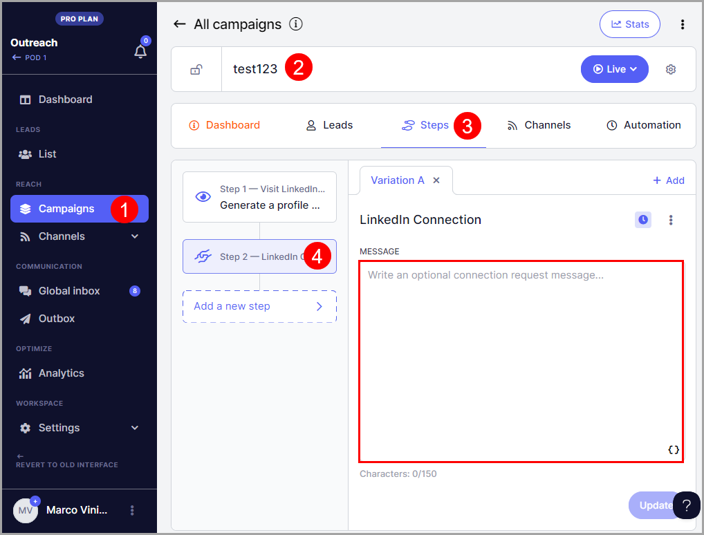
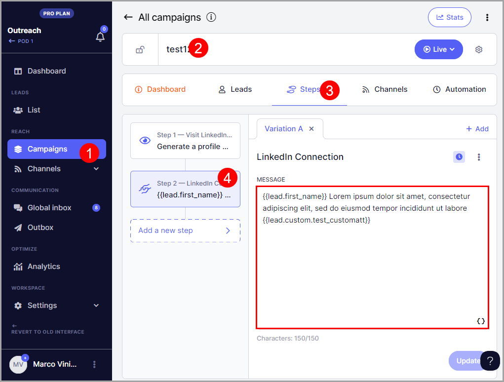

# Sending LinkedIn Connection Requests

💡 The number of LinkedIn accounts that you can add will depend on your plan. It's 1 for Basic, 5 for Pro, and 15 for Expert.

## How does sending a LinkedIn connection request work?

Two types of connection requests can be added to the Connection Request steps, personalized connection requests and blank connection requests.

With our LinkedIn Automation, you can effortlessly craft personalized connection requests and set up automated campaigns.

When a LinkedIn connection step is created, a LinkedIn Profile View step is automatically created before it. This notifies the prospect that someone has viewed their profile and makes the LinkedIn activity look less automated.

## Understanding LinkedIn policies for sending connection requests with a message

LinkedIn applies stricter limits to personalized connection requests (those that include a message).

You can enable the LinkedIn setting: "Send without a message if LinkedIn's personalized invite limit is reached."

When enabled, QuickMail will automatically send the connection request without a message if LinkedIn rejects the personalized invite due to limit restrictions. Since LinkedIn generally allows more connection requests without a message, this helps maximize the number of requests that can be sent.

Otherwise, we will automatically reschedule the LinkedIn connection request with message the following day.

## How many LinkedIn connection requests can I send?

LinkedIn imposes its own weekly limits on connection requests, and these limits can vary from account to account.

In QuickMail, you can configure as many LinkedIn connection requests per day as you'd like. However, we set a default limit of 12 connection requests per day per LinkedIn account to help reduce the risk of account restrictions or suspension.

If you need to send more connection requests, you can increase this limit or connect additional LinkedIn accounts at no extra cost.

## How to add a LinkedIn connection step to a campaign?

**Step 1.** Add a LinkedIn account for sending.

Go to LinkedIn in QuickMail and click Add LinkedIn account.

There are three ways to connect your LinkedIn account. For detailed instructions on each method, see our [LinkedIn Account Setup Guide.](https://help.quickmail.com/linkedin/adding-linkedin-accounts/)

**Step 2.** From your campaign, go to Steps → click the Add Step button → Connection Request Step 

**Step 3.** You can leave the connection request message blank or add a message to send with your LinkedIn connection request. You can also use attributes to personalize the message.

**Note:** If your LinkedIn connection message exceeds 150 characters, the journey will run into an error and the request won't get sent. They won't be able to proceed to the next step until it's fixed To fix this, you will need to shorten your LinkedIn connection request message and resume the journeys manually. 

**Step 4.** Add follow up steps as needed. 

**Note:** By default, **Wait Until Connection Request Is Accepted** is enabled. When this setting is enabled, the lead will pause at the connection request step until the prospect accepts the request.

Once the connection request is accepted, the lead will continue through the sequence, and the follow-up steps will be sent according to the campaign schedule.

If you want follow-up messages to be sent even when the prospect hasn't accepted the connection request, you can disable this setting.

**Step 5.** Add leads to the campaign and then set the campaign live. 

**Note:** The system checks the status of the LinkedIn connection request once a day. So when a prospect accepts the LinkedIn connection request and "Wait until the connection is accepted to resume campaign" is checked, the journey of the prospect won't move to the next step in real time.

💡**Pro tip:** You can send additional LinkedIn Messages once you've connected with the prospects.

## How to cancel a LinkedIn connection request?

To cancel a LinkedIn connection request, go to Prospects → Search for the prospect → Open prospects view → Click X to cancel pending connection request
FYI: QuickMail automatically withdraws them after 90 days of the connection request.

## How to see which LinkedIn account sent the connection request?

It's possible to add multiple LinkedIn accounts in QuickMail.

To see which LinkedIn account sent the connection request, go to Sent → Search for the prospect's email or use an advanced filter to narrow down the list by category → Select a sent item

## How can I change the daily limit for sending LinkedIn connection requests?

- Go to Settings → LinkedIn → Select a LinkedIn account

- Scroll down and look for LinkedIn actions limit and throttling → Set your preferred limits

## How to find leads accepting the connection request
Whenever a lead accepts a connection request, an opportunity gets created by default.
So you can go to the opportunities page to look for them.

FYI: If you don't want accepted connection requests to create an opportunity, you can go to settings > replies > uncheck new opportunities create opportunities.
