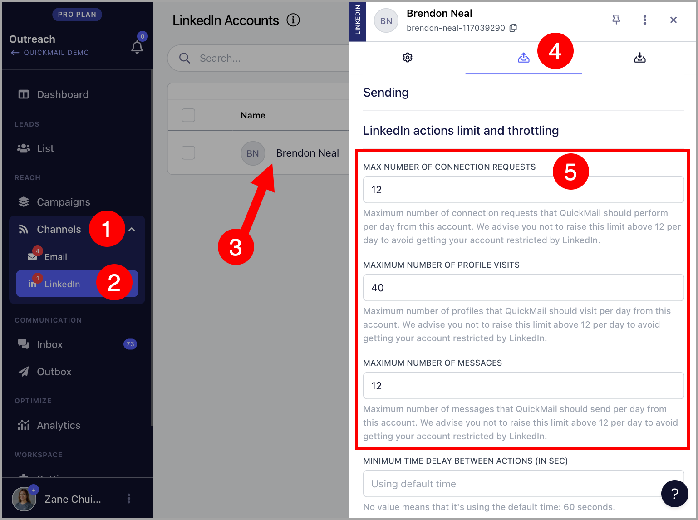

# Sending LinkedIn Connection Requests

💡 The number of LinkedIn accounts that you can add will depend on your plan. It's 1 for Basic, 5 for Pro, and 15 for Expert.

## How does sending a LinkedIn connection request work?

QuickMail lets you send personalized or blank LinkedIn connection requests as part of your campaigns.

When you add a connection request step, a LinkedIn Profile View step is automatically added before it to create a more natural sequence of activity.

You can choose whether to wait for the prospect to accept the connection before continuing to the next step. By default, the campaign waits for the connection to be accepted.

LinkedIn applies limits to connection requests, especially requests that include a personalized message. QuickMail helps manage these limits by allowing you to send without a message when LinkedIn's personalized invite limit is reached.

You can also set daily sending limits for each LinkedIn account to help control your sending volume and reduce the risk of LinkedIn restrictions.

When a LinkedIn connection step is created, a LinkedIn Profile View step is automatically created before it. This notifies the prospect that someone has viewed their profile and makes the LinkedIn activity look less automated.

## ⚠️ IMPORTANT: LinkedIn policies and limits to know before sending

Before sending LinkedIn connection requests through QuickMail, keep the following LinkedIn limits and restrictions in mind:

**LinkedIn limits connection requests**

LinkedIn sets its own limits on the number of connection requests an account can send. These limits can vary between accounts and may change over time.

QuickMail has a default limit of 12 connection requests per day per LinkedIn account to help reduce the risk of account restrictions or suspension. You can adjust this limit in Settings → LinkedIn → select your LinkedIn account → LinkedIn actions limit and throttling.

Increasing the limit in QuickMail does not increase LinkedIn's own limits. If an account reaches a LinkedIn-imposed limit, requests may be delayed or rejected.

**Personalized connection requests have stricter limits**

LinkedIn applies stricter limits to connection requests that include a personalized message.

To help with this, you can enable Send without a message if LinkedIn's personalized invite limit is reached. When enabled, QuickMail will automatically send the connection request without a message if LinkedIn rejects the personalized request because the limit has been reached.

If this option is disabled, QuickMail will reschedule the personalized connection request for the following day.

**Keep connection messages within LinkedIn's character limit**

LinkedIn connection request messages are limited to 150 characters. If your message exceeds this limit, the request won't be sent and the lead will remain at that step until the message is corrected.

If this happens, shorten the message, be careful with using custom fields, and manually resume the affected journeys.

**Use sending limits responsibly**

LinkedIn limits are account-specific, so avoid increasing your QuickMail sending limit simply to send as many requests as possible. We recommend gradually increasing your sending volume and monitoring your LinkedIn accounts for restrictions or errors.

Using multiple LinkedIn accounts can help distribute your sending volume, but each account remains subject to LinkedIn's own limits and policies.

**Sending LinkedIn Messages**

LinkedIn doesn't allow sending messages to leads you're not yet connected with. By default, **Wait Until Connection Request Is Accepted** is enabled in the Connection Request Step. This means that the lead will pause at the connection request step until the prospect accepts the request.

## How to add a LinkedIn connection step to a campaign?

**Step 1.** Add a LinkedIn account for sending.

Go to LinkedIn in QuickMail and click Add LinkedIn account.

There are three ways to connect your LinkedIn account. For detailed instructions on each method, see our [LinkedIn Account Setup Guide.](https://help.quickmail.com/linkedin/adding-linkedin-accounts/)

**Step 2.** From your campaign, go to Steps → click the Add Step button → Connection Request Step 

**Step 3.** You can leave the connection request message blank or add a message to send with your LinkedIn connection request. You can also use attributes to personalize the message.

**Step 4.** Add follow up steps as needed. 

**Step 5.** Assign the LinkedIn account to the campaign.

**Step 6.** Add leads to the campaign and then set the campaign live. 

**Note:** The system checks the status of the LinkedIn connection request once a day. So when a prospect accepts the LinkedIn connection request and "Wait until the connection is accepted to resume campaign" is checked, the journey of the prospect won't move to the next step in real time.

## How to cancel a LinkedIn connection request?

To cancel a LinkedIn connection request, go to Prospects → Search for the prospect → Open prospects view → Click X to cancel pending connection request
FYI: QuickMail automatically withdraws them after 90 days of the connection request.

## How to see which LinkedIn account sent the connection request?

It's possible to add multiple LinkedIn accounts in QuickMail.

To see which LinkedIn account sent the connection request, go to Sent → Search for the prospect's email or use an advanced filter to narrow down the list by category → Select a sent item

## How can I change the daily limit for sending LinkedIn connection requests?

- Go to Settings → LinkedIn → Select a LinkedIn account

- Scroll down and look for LinkedIn actions limit and throttling → Set your preferred limits

## How to find leads accepting the connection request
Whenever a lead accepts a connection request, an opportunity gets created by default.
So you can go to the opportunities page to look for them.

FYI: If you don't want accepted connection requests to create an opportunity, you can go to settings > replies > uncheck new opportunities create opportunities.
