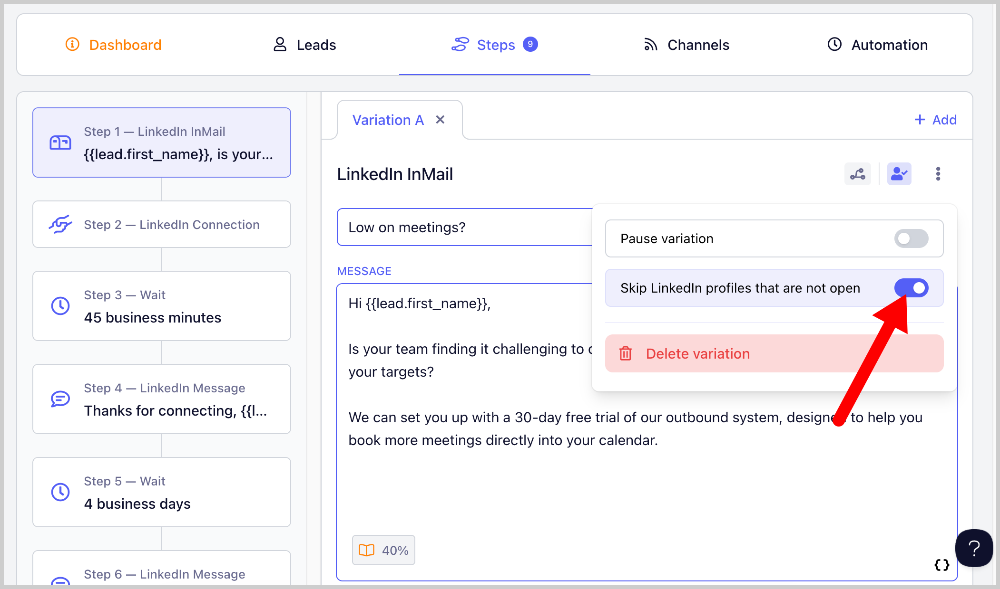
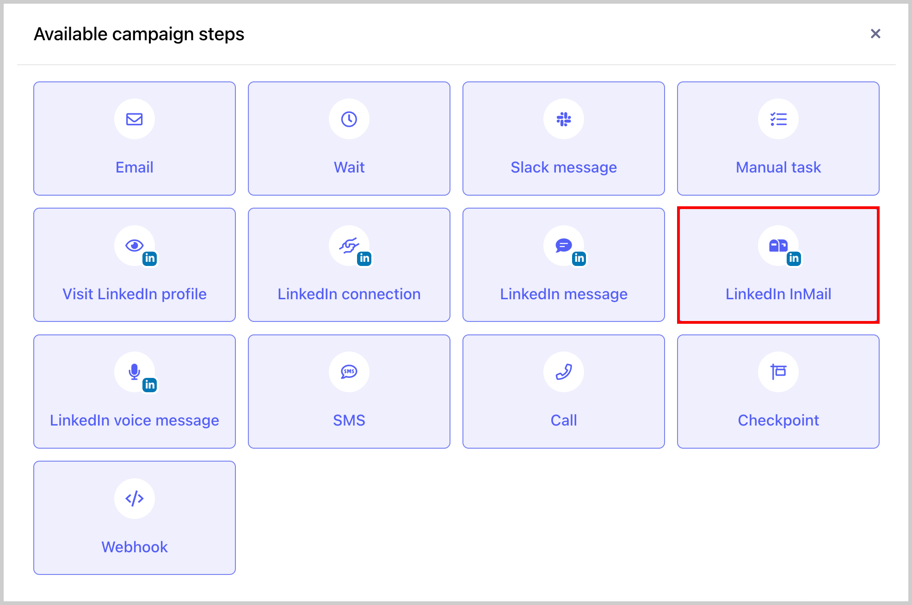
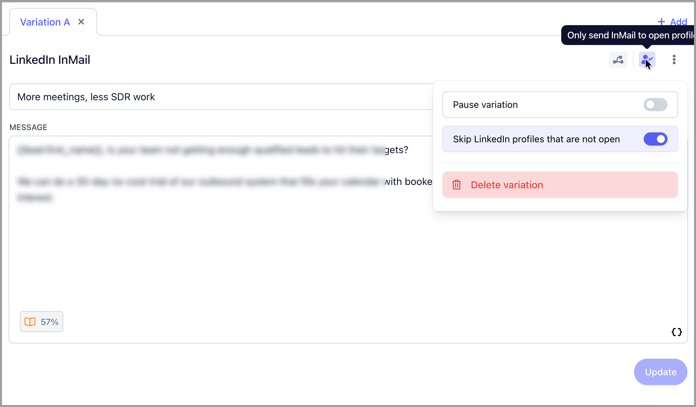

# Sending LinkedIn InMail 📭

It’s now possible to send LinkedIn InMail directly through your campaigns in QuickMail.

## Why use it?

LinkedIn InMail lets you reach prospects directly, even if you’re not connected with them. This makes it a powerful way to expand your outreach beyond your existing network.

With QuickMail, you can automate and personalize InMail messages at scale while keeping your outreach organized and trackable. It’s ideal for:

- Sales outreach

- Recruiting

- Networking

- Reaching high-value prospects outside your connections

## How does it work?

LinkedIn InMail uses the credits included with your LinkedIn Premium subscription to send private messages directly to LinkedIn members outside your network.

QuickMail integrates with LinkedIn to automate the sending process while still allowing you to personalize each message and control when messages are sent through your campaign schedule.

##

## Scaling with Free InMail

You can also scale LinkedIn outreach without consuming InMail credits by targeting LinkedIn users with an Open Profile.

You do NOT need a LinkedIn Premium account to message Open Profiles. Open Profiles allow you to message those users directly, even without being connected and without using InMail credits.

QuickMail lets you filter prospects based on Open Profile status, so you can automatically include only those leads in your campaigns.

This means you can:

- Add Open Profile leads directly into your campaigns

- Message them without sending a connection request

- Avoid using InMail credits

It’s an effective way to significantly increase outreach volume while keeping costs low.

## How to send InMails from QuickMail?

**Step 1** . To use LinkedIn InMail in your QuickMail campaign, first connect your LinkedIn account that has InMail credits.

**Step 2.** Go to a campaign →  Steps →  Add Step →  Add LinkedIn InMail Step

**Step 3.** Add your message in the subject and body. Make sure to save changes

**Step 4:** If you don't have enough InMail credits, you can set the InMail to only send to open profiles because open profiles don't consume InMail credits.

If this is set, leads with LinkedIn that are not open profile will skip the InMail step instead of running into an error.

**Step 5:** Make sure to set the campaign live. Once a lead reaches the LinkedIn InMail step, they will receive the InMail message.

To know more about QuickMail's LinkedIn Automation, check out this guide: LinkedIn Automation

**Note:** Open profile or not, InMail can only be sent to leads you haven't had a conversation with in the past.
Because of that, it's recommended to send it before the connection request.
