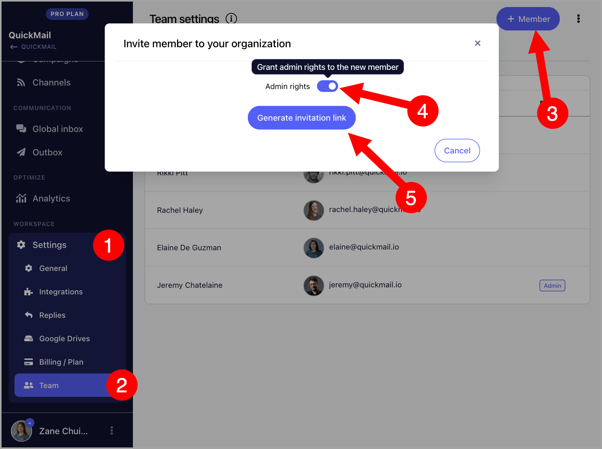
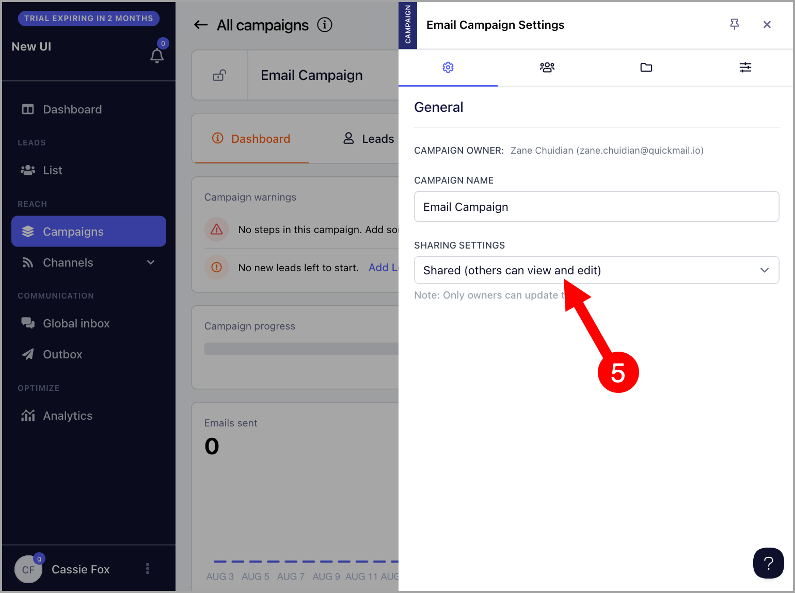

# Managing Team Members 

In QuickMail, you can easily grant access to colleagues or clients using their own email addresses. This allows seamless collaboration in managing an account without the need to share logins.

If you have an agency, please refer to this guide instead: [Managing Team Members for Agencies](https://help.quickmail.com/for-agencies/team-members-and-guests-for-agencies/)

**Note:** You can add as many team members and guests as needed at no additional charge.

**In this article:**

- Types of team access in QuickMail

- Admins

- Team Members

- Guests

- How to add a team member?

- How to change team member roles?

- How to add guests?

- Where can I see each team member's activities?

- Why are campaigns, replies, or email accounts not visible to other team members?

- FAQs

## What Are the Types of Team Access in QuickMail?

There are three types of team access in QuickMail: **Admins**, **Team Members**, and **Guests**.

## Admins

Admins can do everything except:

- Manage private email accounts and campaigns owned by a different team member.

## Team Members

Team members can do everything except:

- Manage private email accounts and campaigns owned by a different team member.

- Change the card on the billing page.

- Purchase or update the subscription.

- Buy email verification credits.

## Guests

Guests can or cannot have edit access. If a guest has edit access, they can do everything except:

- Manage private email accounts and campaigns owned by a different team member.

- Access workspace settings.

## How to Add a Team Member?

Go to **Settings** → **Team** → click **+ Member** → toggle **Admin Rights** on if you would like to provide admin access → click **Generate Invitation Link**.

Copy the invite link → send it to the person you want to add.

New team members can log in with their email (Google or Outlook) or LinkedIn account.

**Note:** An invite link expires once used. A new invite link must be generated for each additional team member.

## How to Change a Team Member's Role?

Once a team member is added, they will appear under the **Members** tab in Team Settings, showing whether they are an admin or not.

To grant or remove admin access, click on the team member and change their admin access.

## How to Add Guests?

Go to **Settings** → **Team** → **Guests** tab → click **+ Guest** in the top-right corner.

Select your preferred editing permission → click **Generate Invite Link**.

Copy the invite link and send it to your client.

**Note:** Invitation links are only valid for 24 hours.

## Where Can I See Each Team Member's Activities?

All activities can be seen and filtered on the Changelog page.

Go to **Settings** → **Team** → **Changelog**.

## Why Are My Email Accounts, Inbox Items, and Campaigns Not Visible to Other Team Members?

Email accounts, Inbox items, and campaigns are private by default and are only visible to their owners. To make them visible to other team members, they must be set to Shared.

### Share an email account

Go to **Email** → click the thumbnail of the email account → change the sharing settings.

### Share a campaign

Go to the campaign → click the gear icon.

Change the **Sharing Settings** to **Shared**.

## FAQs

**Q: Can I limit my team member's activity?**

A: There's currently no option to limit your team member's activity. The workaround for now is to add them as guests instead to temporarily add/remove edit access. 

**Q: Why can't I generate an invite link?**

A: Only team members of the account can generate an invite. If the email address you are using to access QuickMail is not added as a team member, attempting to generate an invite link will result in a permission error.

**Q: How many team members can I add?**

A: There is no limit to the number of team members you can add.
